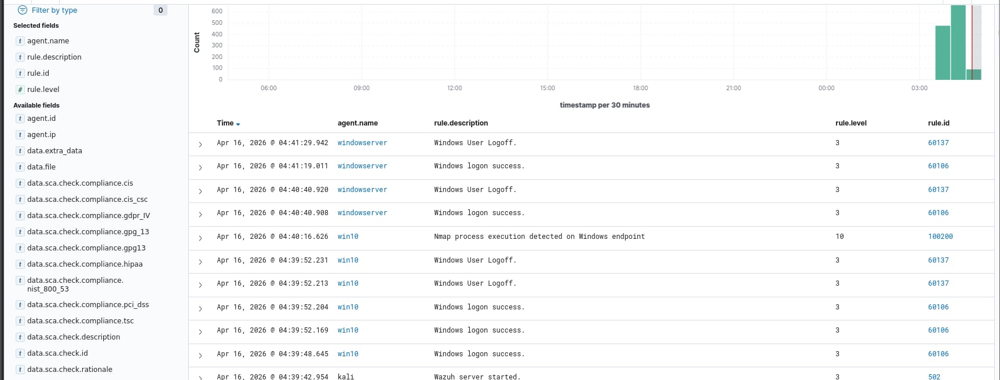

## Scenario: Network Scan Detection (Zenmap)

**Tool:** Zenmap (GUI for Nmap)

**Description:**
A network scan was performed from Kali Linux using Zenmap to discover open ports and services on the target machine.

**Command (Equivalent Nmap):**
nmap -sS <target-ip>

**Detection:**
- Wazuh detected potential port scanning activity
- Snort generated alert for suspicious network traffic

